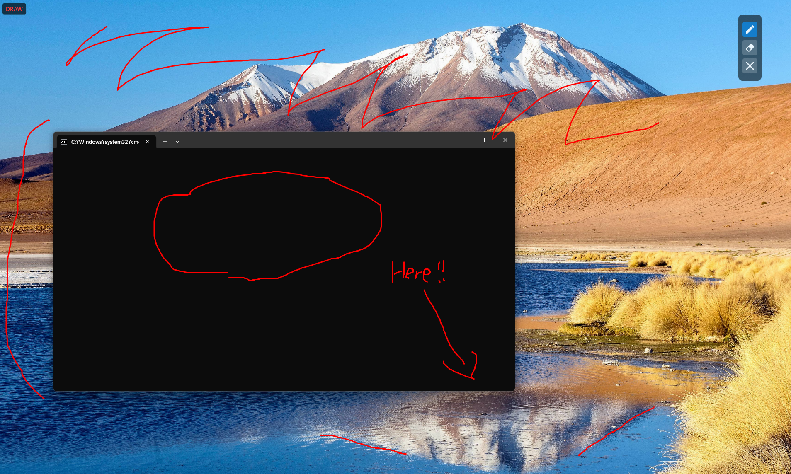

# Desktop Ink

A lightweight, always-on-top drawing overlay application for Windows that allows you to annotate your screen with ink strokes.

## Screenshot



## Features

- **Multi-Monitor Support**: Works seamlessly across multiple displays
- **Transparent Overlay**: Draw directly on top of any application
- **Multiple Drawing Modes**:
  - Permanent Draw Mode: Toggle on/off with hotkey or control palette
  - Temporary Draw Mode: Quick annotation with Shift double-click + hold
- **Control Palette**: Always-accessible floating control panel
- **Global Hotkeys**: Control the app from anywhere

## Requirements

- Windows 10/11
- .NET 10.0

## Installation

1. Clone the repository
2. Build the solution using Visual Studio or the command line:
   ```cmd
   scripts\build.cmd
   ```
3. Run the application:
   ```cmd
   scripts\run.cmd
   ```

## Usage

### Starting the Application

Run `Desktop Ink` and it will start with transparent overlay windows on all your monitors. The control palette will appear as a small floating window.

### Drawing Modes

#### Permanent Draw Mode

Toggle persistent drawing mode on or off:

- **Keyboard**: Press `Win+Shift+D`
- **Control Palette**: Click the "Draw Mode" button

When draw mode is active, you can draw ink strokes on any overlay window. Strokes remain until you clear them manually.

#### Temporary Draw Mode (Quick Annotation)

For quick, temporary annotations:

1. **Double-click the Shift key** rapidly (within system double-click time)
2. **Hold down the Shift key** while drawing
3. **Release the Shift key** - all strokes automatically clear and you return to pass-through mode

This mode is perfect for brief annotations without needing to toggle modes or manually clear strokes.

### Global Hotkeys

The following hotkeys work even when Desktop Ink is not focused:

| Hotkey | Action |
|--------|--------|
| `Win+Shift+D` | Toggle permanent draw/pass-through mode |
| `Win+Shift+C` | Clear all ink strokes from all monitors |
| `Win+Shift+Q` | Quit the application |

### Control Palette

The control palette provides clickable buttons for:

- **Toggle Draw Mode**: Switch between draw and pass-through mode
- **Clear All**: Remove all ink strokes
- **Quit**: Exit the application

The palette is:
- Always on top of other windows
- Semi-transparent for minimal obstruction
- Draggable - click and drag to reposition

### Pass-Through Mode

When not in draw mode, the overlay windows are completely transparent to mouse input, allowing you to interact with applications underneath as normal.

## Building from Source

### Debug Build

```cmd
scripts\build.cmd
```

### Release Build

```cmd
dotnet build src\DesktopInk\DesktopInk.csproj -c Release
```

### Running

```cmd
# Run debug build
scripts\run.cmd

# Run release build
scripts\run-release.cmd
```

## Architecture

Desktop Ink is built using WPF and consists of:

- **Overlay Windows**: One per monitor, full-screen transparent windows for drawing
- **Control Window**: Draggable palette with control buttons
- **Keyboard Hook Manager**: Low-level keyboard hook for global hotkeys and temporary mode detection
- **Overlay Manager**: Manages multi-monitor overlay lifecycle

## License

[Specify your license here]

## Contributing

[Specify contribution guidelines if applicable]
